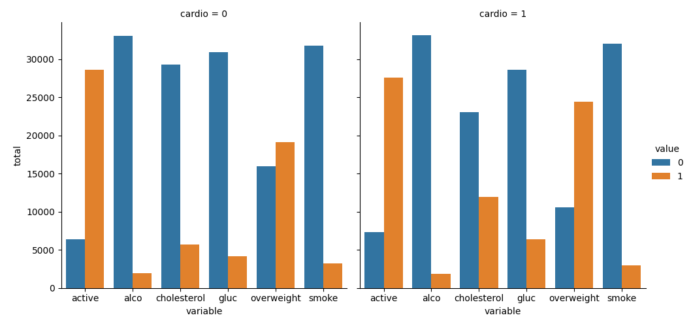
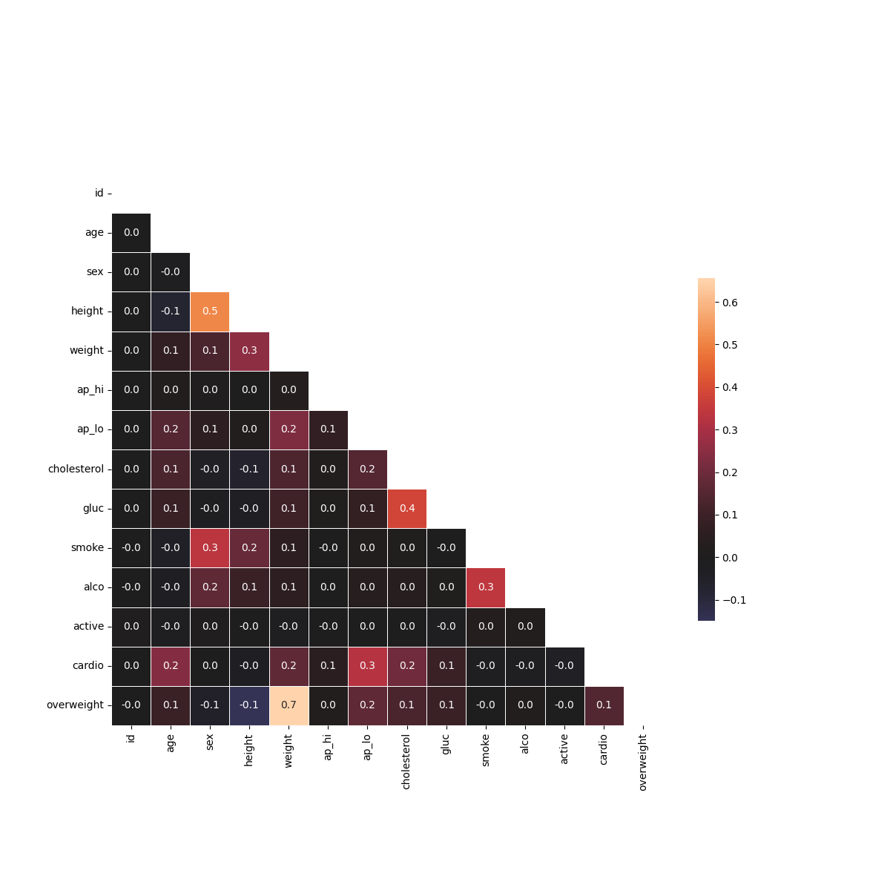
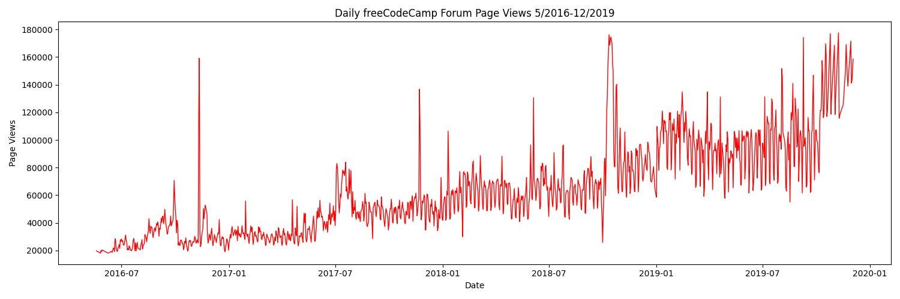
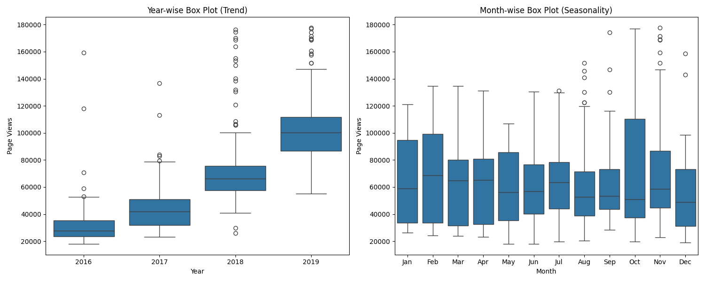
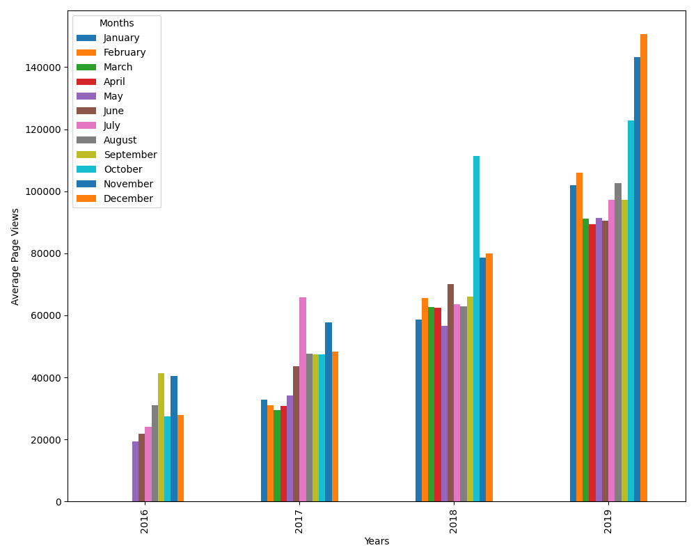

# Data Analysis with Python

This repository contains my completed projects for the Data Analysis with Python course by [freeCodeCamp](https://www.freecodecamp.org/learn) I've completed with the [certification](https://github.com/ulyanafrolova/freeCodeCamp/blob/main/Certficate.png).

---

## Skills & Tools Used
* **Data Manipulation:** `Python`, `Pandas`, `NumPy`
* **Data Visualization:** `Matplotlib`, `Seaborn`
* **Statistical Analysis:** `SciPy`

---

## Projects

### [Mean-Variance-Standard Deviation Calculator](https://github.com/ulyanafrolova/freeCodeCamp/blob/main/mean_var_std.py)
Transforms a list of 9 numbers into a 3×3 matrix and computes the mean, variance, standard deviation, max, min, and sum across rows, columns, and the entire matrix. Built with **NumPy** and designed with strict input validation.

### [Demographic Data Analyzer](https://github.com/ulyanafrolova/freeCodeCamp/blob/main/demographic_data_analyzer.py)
This project analyzes demographic data from the U.S. Census dataset using **Pandas** to calculate and extract insights:
* Number of individuals in each race category.
* Average age of men.
* Percentage of people with a Bachelor's degree.
* Income statistics based on education level.
* Minimum weekly work hours and the percentage of high earners among them.
* Country with the highest percentage of people earning >50K.
* Most common occupations in India.

### [Medical Data Visualizer](https://github.com/ulyanafrolova/freeCodeCamp/blob/main/medical_data_visualizer.py)
Processes and visualizes a dataset of medical examinations. Calculates BMI to classify patients as overweight, normalizes cholesterol and glucose data, and produces two comprehensive visualizations to find correlations:

* **Categorical Plot** – compares health indicators between patients with and without cardiovascular disease.
* **Heatmap** – shows correlations between medical variables after filtering outliers.

**Results:**

> *Categorical Plot:*
>  
> *Correlation Heatmap:*
> 

### [Page View Time Series Visualizer](https://github.com/ulyanafrolova/freeCodeCamp/blob/main/time_series_visualizer.py)
Analyzes daily page views on the freeCodeCamp forum from May 2016 to December 2019. The dataset was cleaned by removing the top and bottom 2.5% of page views to eliminate extreme outliers. The date column was converted into a datetime index for time-series handling. 

Visualizations generated to highlight long-term trends and seasonal patterns:
* **Line Plot** - shows overall page views over time and highlights the long-term upward/downward trends.
* **Bar Plot** - displays the average monthly page views for each year and helps compare year-to-year performance.
* **Box Plots** - year-wise box plot shows how the distribution of page views changes over years, and month-wise box plot reveals seasonal patterns across different months.

**Results:**
> *Line Plot:*
>  
> *Box Plot:*
> 
> *Bar Plot:*
> 

### Sea Level Predictor
Analyzes historical datasets of global average sea level changes since 1880. This project uses **Pandas** to process the data and **Matplotlib** with **SciPy** to visualize and predict future sea levels. 
The script creates a scatter plot of historical data and uses `scipy.stats.linregress` to calculate:
1. A line of best fit for the entire dataset (1880 - present) extending to the year **2050**.
2. A second line of best fit using only recent data (from the year 2000 onwards) to predict a more accurate rate of sea level rise by **2050**.

**Results:**
> *Sea Level Prediction Plot:*
>  
